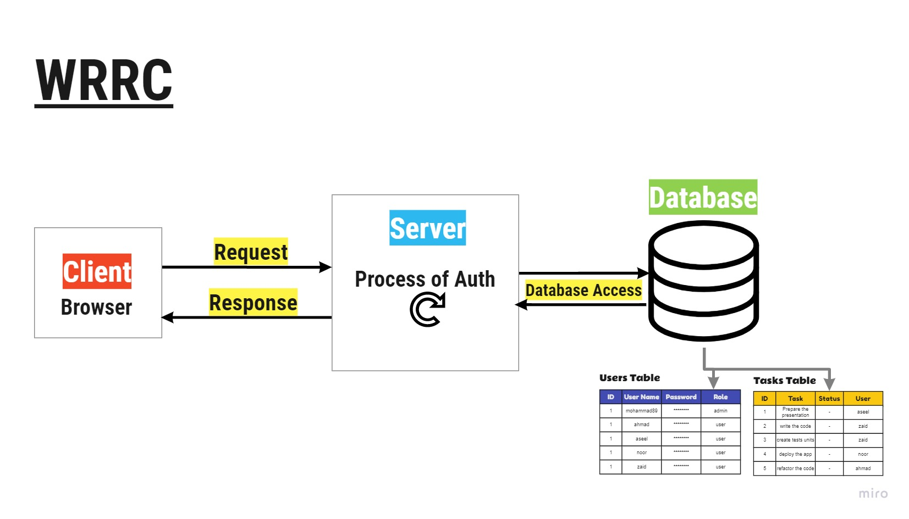

# Taskify

## Employee Monitoring Application
An application enable the employer to manage and track the workflow of his employees. The application enable the employer to add new employees and assign tasks to them, and he can edit or delete the tasks and even the employees. On the other hand, the employees can sign in using thier account and check thier duties and tasks.

## URLs
* [live Server](https://bianqt-auth-module-project.herokuapp.com/)

## Application Wireframe 

## WRRC 

